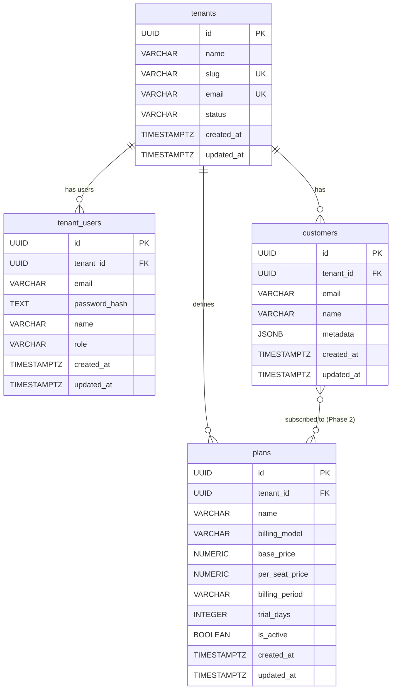
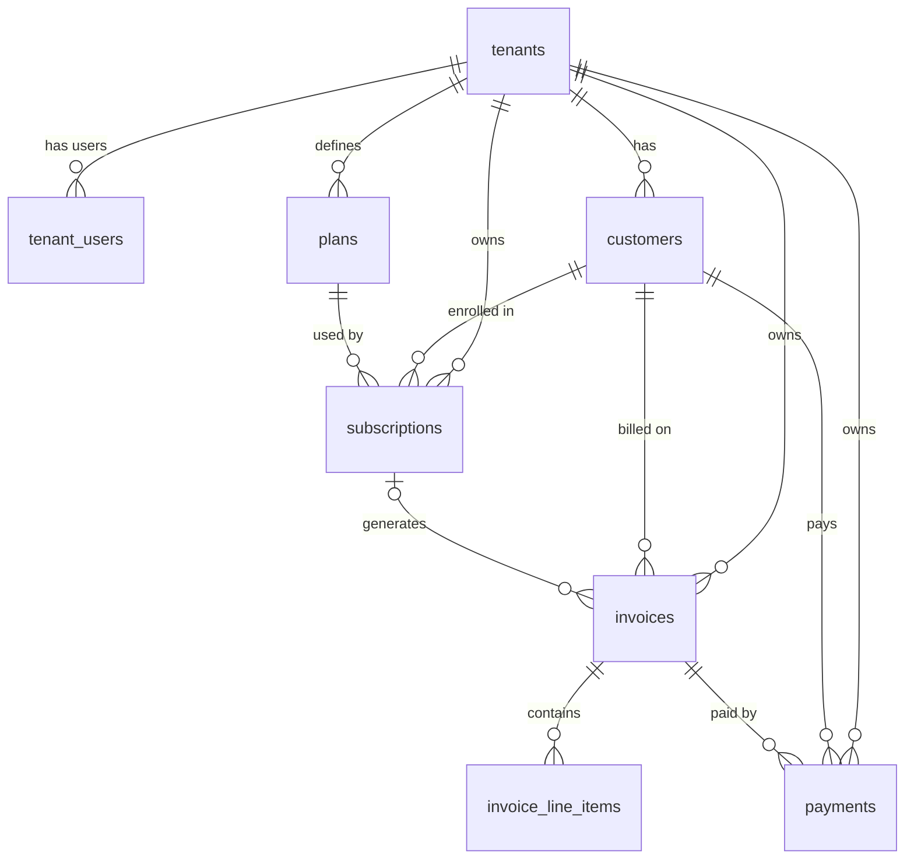

# ER Diagram — SaaS Billing Engine

---

## Phase 1 — Core Entities (Building Now)

Four tables: `tenants`, `tenant_users`, `plans`, `customers`
Subscription link shown as a stub — built in Phase 2.



---

## Phase 1 — Column Reference

### `tenants`
| Column | Type | Constraint | Notes |
|---|---|---|---|
| `id` | `UUID` | PK, DEFAULT gen_random_uuid() | Surrogate key |
| `name` | `VARCHAR(255)` | NOT NULL | Business display name |
| `slug` | `VARCHAR(100)` | NOT NULL, UNIQUE | URL/subdomain identifier |
| `email` | `VARCHAR(255)` | NOT NULL, UNIQUE | Owner billing contact |
| `status` | `VARCHAR(20)` | NOT NULL, CHECK IN ('active','suspended','cancelled') | Tenant lifecycle state |
| `created_at` | `TIMESTAMPTZ` | NOT NULL, DEFAULT NOW() | |
| `updated_at` | `TIMESTAMPTZ` | NOT NULL, DEFAULT NOW() | Maintained by trigger |

---

### `tenant_users`
| Column | Type | Constraint | Notes |
|---|---|---|---|
| `id` | `UUID` | PK, DEFAULT gen_random_uuid() | |
| `tenant_id` | `UUID` | FK → tenants(id) ON DELETE CASCADE | User dies with tenant |
| `email` | `VARCHAR(255)` | NOT NULL | |
| `password_hash` | `TEXT` | NOT NULL | bcrypt hash, never plain text |
| `name` | `VARCHAR(255)` | NOT NULL | Display name |
| `role` | `VARCHAR(20)` | NOT NULL, DEFAULT 'member', CHECK IN ('owner','member') | owner = full access |
| `created_at` | `TIMESTAMPTZ` | NOT NULL, DEFAULT NOW() | |
| `updated_at` | `TIMESTAMPTZ` | NOT NULL, DEFAULT NOW() | Maintained by trigger |

**Composite UNIQUE:** `(tenant_id, email)` — email unique per tenant, not globally.

---

### `plans`
| Column | Type | Constraint | Notes |
|---|---|---|---|
| `id` | `UUID` | PK, DEFAULT gen_random_uuid() | |
| `tenant_id` | `UUID` | FK → tenants(id) ON DELETE CASCADE | Plan belongs to tenant |
| `name` | `VARCHAR(100)` | NOT NULL | e.g. "Starter", "Pro" |
| `billing_model` | `VARCHAR(20)` | NOT NULL, CHECK IN ('flat_rate','per_seat','usage_based') | |
| `base_price` | `NUMERIC(12,2)` | NOT NULL, CHECK >= 0 | Monthly/annual base fee |
| `per_seat_price` | `NUMERIC(12,2)` | CHECK >= 0, nullable | Only used when billing_model = 'per_seat' |
| `billing_period` | `VARCHAR(10)` | NOT NULL, DEFAULT 'monthly', CHECK IN ('monthly','annual') | |
| `trial_days` | `INTEGER` | NOT NULL, DEFAULT 0, CHECK >= 0 | 0 = no trial |
| `is_active` | `BOOLEAN` | NOT NULL, DEFAULT true | Soft delete — deactivate, never delete |
| `created_at` | `TIMESTAMPTZ` | NOT NULL, DEFAULT NOW() | |
| `updated_at` | `TIMESTAMPTZ` | NOT NULL, DEFAULT NOW() | Maintained by trigger |

**Cross-column CHECK:** `billing_model != 'per_seat' OR per_seat_price IS NOT NULL`
— per_seat_price is required when model is per_seat.

---

### `customers`
| Column | Type | Constraint | Notes |
|---|---|---|---|
| `id` | `UUID` | PK, DEFAULT gen_random_uuid() | |
| `tenant_id` | `UUID` | FK → tenants(id) ON DELETE CASCADE | Customer belongs to tenant |
| `email` | `VARCHAR(255)` | NOT NULL | |
| `name` | `VARCHAR(255)` | NOT NULL | |
| `metadata` | `JSONB` | nullable | Flexible per-tenant extra fields |
| `created_at` | `TIMESTAMPTZ` | NOT NULL, DEFAULT NOW() | |
| `updated_at` | `TIMESTAMPTZ` | NOT NULL, DEFAULT NOW() | Maintained by trigger |

**Composite UNIQUE:** `(tenant_id, email)` — email unique per tenant, not globally.

---

## Phase 1 — Relationship Summary

| Relationship | Cardinality | ON DELETE | Reasoning |
|---|---|---|---|
| tenant → tenant_users | 1:N | CASCADE | Users are owned by tenant; no orphans |
| tenant → plans | 1:N | CASCADE | Plans are tenant-defined; die with tenant |
| tenant → customers | 1:N | CASCADE | Customers belong to one tenant |
| customer ↔ plan | M:N via subscriptions | — | Resolved in Phase 2 via `subscriptions` table |

---

## Phase 2+ Entities (Not Yet Built)

These tables complete the billing flow — shown here for reference only.

```
subscriptions   — resolves customer ↔ plan M:N, tracks billing periods
invoices        — generated per billing cycle per subscription
invoice_line_items — line-by-line breakdown of each invoice
payments        — recorded payments against invoices
audit_log       — trigger-populated change history for all tables
```

Full diagram including Phase 2+ entities:


